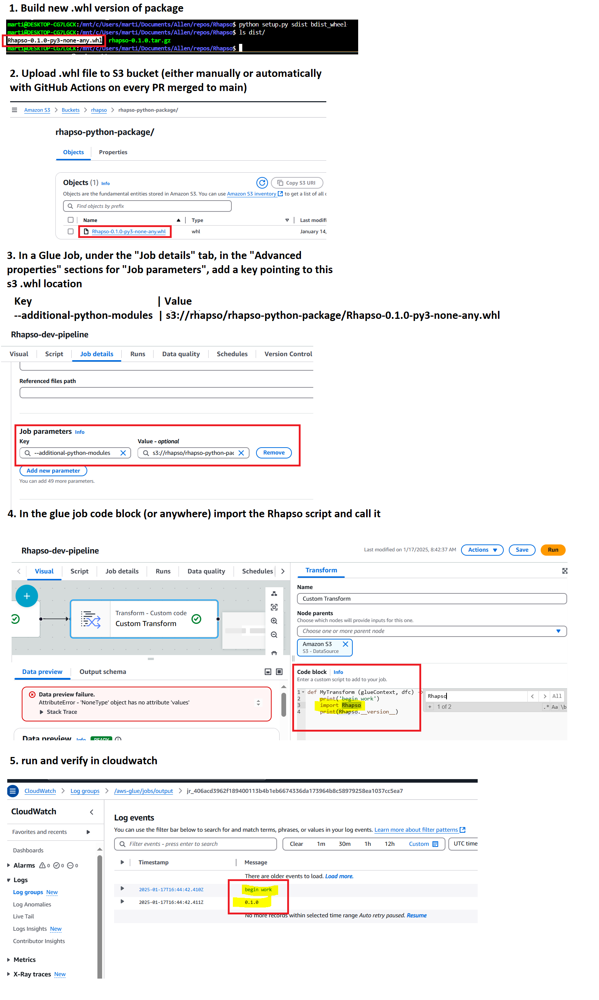

# Rhapso

**Rhapso** is a modular Python toolkit for aligning and fusing large-scale microscopy datasets. Built from decoupled components, Rhapso separates data loading and execution logic from its core functionality, making it flexible and easy to adapt across environments and formats.

To run Rhapso, users can either provide a data loader and a pipeline script that orchestrates the processing steps or use one of ours. We include example loaders and pipeline scripts to support both large-scale runs on AWS Glue (Spark ETL) and smaller-scale testing on local or conventional machines. Input formats like OME-TIFF and Zarr are supported out of the box.

Rhapso is developed in collaboration with the Allen Institute for Neural Dynamics (AIND), initially supporting AIND’s ExaSPIM pipeline and eventually broadly benefiting microscopy research.

## Example Usage Media Content Coming Soon....

[](LICENSE)

--

## Connect With Us
<!-- UPDATE THIS WHEN OPEN SOURCED -->
  [Allen Institute Internal Coms](https://teams.microsoft.com/l/channel/19%3AIv_3CdryfboX3E0g1BbzCi3Y8KRgNCdAv3idJ9epV-k1%40thread.tacv2/Project%20Rhapso-Shared?groupId=87b91b48-bb2a-4a00-bc59-5245043a0708&tenantId=32669cd6-737f-4b39-8bdd-d6951120d3fc&ngc=true&allowXTenantAccess=true)

## Table of Contents
- [Componenents Walkthrough](#components-walkthrough)
- [Sample Data](#sample-data)
- [Command Line Usage](#command-line-usage)
- [Setup Instructions](#setup-instructions)
- [Build Package](#build-package)
  - [Using the Built `.whl` File](#using-the-built-whl-file)
- [Run Tests](#run-tests)
- [Environments](#environments)
- [Use Cases](#use-cases)
- [FAQ](#frequently-asked-questions)

---

## Components Walkthrough

This guide offers a high-level overview of Rhapso components, explaining each component's role in the process. It’s designed for users who want to understand or modify Rhapso’s process.

### Interest Point Detection
 Interest Point Detection involves detecting interest points by converting XML metadata into DataFrames, generating transformation matrices, detecting overlaps, loading and preprocessing image data,refining detected points, and saving the refined interest points for matching.

For more in depth information, checkout the [Detection ReadMe](./Rhapso/detection/readme.md)

### Interest Point Matching

Interest Point Matching involves loading and filtering interest points, organizing views, setting up pairwise matching, applying the RANSAC algorithm, refining matches, and compiling and storing results for Solver.

For more in depth information, checkout the [Matching ReadMe](./Rhapso/matching/readme.md)

### Solver

  Solver involves setting up models and tiles, aligning tiles using transformation models, performing optimization for consistency in preparation for Fusion.

For more in depth information, checkout the [Solver ReadMe](./Rhapso/solver/readme.md)


### Cloud Fusion
To Do

---

### Fully Local

```sh
pip install Rhapso
Rhapso detect --i '../../dataset.zarr' --o '../dataset_with_ip.xml'
```

### Fully in Cloud

Install Rhapso package and call it either via CLI, Python module, or as a Python library in scripts.

### Cloud/Local Hybrid

```sh
pip install Rhapso
aws configure
Rhapso detect --i 's3://data.zarr' --o 's3://output/my_dataset.xml'
```


## Command Line Usage

After installing Rhapso, you can use the following commands:

### View General Help

```bash
Rhapso -h
```

### View Subcommand-Specific Help

```bash
Rhapso detect -h   # Detect Help  
Rhapso match -h    # Match Help  
Rhapso fuse -h     # Fuse Help  
Rhapso solve -h    # Solve Help
```

## Example CLI Commands

```bash
# 1. Detect Interest Points
Rhapso detect --sigma 1.8 --threshold 0.05 --medianFilter 10

# 2. Match Features
Rhapso match --x debug --l debug --method ICP \
  --tiffPath "/home/martin/Documents/Allen/BigStitcherSpark Example Datasets/Interest Points (unaligned)/IP_TIFF_XML (after detection)/spim_TL18_Angle0.tif"

# 3. Affine Fusion
Rhapso fuse --scale 2.0 --output ./output/fused.tif --blend

# 4. Solve Transformations
Rhapso solve --method Affine --iterations 50 --tolerance 0.0005
```

### Example Commands:
```sh
# Example script run for import method
python example.py 

# Run locally with local xml file
Rhapso --xmlToDataframe /mnt/c/Users/marti/Documents/Allen/repos/Rhapso-Sample-Data/IP_TIFF_XML/dataset.xml

# Run locally with cloud s3 xml file (must run aws configure first, and give iam access with correct s3 permission) 
Rhapso --xmlToDataframe s3://rhapso-dev/rhapso-sample-data/dataset.xml

# Run overlap detection locally with a local xml file
Rhapso --xmlToDataframe ../../demo/dataset.xml --runOverlapDetection

# Run overlap detection locally with a aws s3 cloud xml file
Rhapso --xmlToDataframe s3://rhapso-dev/rhapso-sample-data/dataset.xml --runOverlapDetection
```
Run overlap detection in Python script:

```sh
import Rhapso

# Call the xmlToDataframe function
# myDataframe = Rhapso.xmlToDataframe("/mnt/c/Users/marti/Documents/Allen/repos/Rhapso-Sample-Data/IP_TIFF_XML/dataset.xml")
myDataframe = Rhapso.xmlToDataframe("s3://rhapso-dev/rhapso-sample-data/dataset.xml")
print('myDataframe = ', myDataframe)

# Call the runOverlapDetection function
overlapDetection = Rhapso.OverlapDetection()
output = overlapDetection.run(myDataframe)
print("Overlap Detection Output: ", output)
```

### Python Pipeline Guide: Rhapso/pipelines/python_pipeline.py

### Overview
This pipeline provides a local execution environment for Rhapso, utilizing its core components to demonstrate the system's capabilities with sample data. It is designed to showcase how flexible and adaptable Rhapso is, allowing users to customize and interchange components to fit various use cases.

### Getting Started
1.	Location: The pipeline script is located at Rhapso/pipelines/python_pipeline.py.
2.	Purpose: Ideal for users new to Rhapso or those looking to explore its functionalities by stepping through the process with provided [sample data](#sample-data).
3.	Customization: Discover how to modify and tailor Rhapso to meet specific needs by experimenting with the components within this pipeline.

### Configuration
- Sample Data: To get started with the sample data, visit [sample data](#sample-data).
- Parameters: The pipeline requires setting parameters that vary based on your dataset size. These parameters are crucial for optimizing the execution of your pipeline.
-	Optimization: For detailed guidance on setting up optimization parameters, check out [Run Parameter Configurations](#run-parameter-configurations).

### Running the Job
1. Follow [Setup Instructions](#setup-instructions).
2. Navigate your terminal to the root folder of Rhapso. In your terminal, run: python Rhapso/pipelines/python_pipeline.py.

### Monitoring
Follow the steps in the pipeline script to understand the sequence and integration of Rhapso components. Each step is an opportunity to tweak and learn about the system’s flexibility in real-time applications.
<br>

### Spark ETL Pipeline Guide: Rhapso/pipelines/spark_etl_pipeline.py

### Overview
This pipeline enables the execution of Rhapso on production data using AWS Glue's Spark ETL capabilities, which is ideal for processing large-scale datasets, specifically when dealing with OME image data in terabytes or larger.

### Prerequisites
1.	AWS Account: Ensure you have an active AWS account. Sign up or log in here.
2.	Navigate to AWS Glue: Access AWS Glue from your AWS Management Console. Find it under "Services" or use the search bar.

### Setup
1.	Access ETL Jobs:
-	In AWS Glue, select "ETL Jobs" from the left sidebar.
-	Click on "Add Job" to start a new ETL job setup.
2.	Configure the Job:
-	Choose "Spark" as the ETL engine and select "Start Fresh" in the script editor.
-	In the script editor, paste the contents of Rhapso/pipelines/spark_etl_pipeline.py.
3.	Import Rhapso Library:
-	Navigate to "Job Details", then scroll to "Advanced Properties".
-	Under "Job Parameters", add --additional-python-modules as the key.
-	For the value, input the full S3 path to the .whl file containing the Rhapso project.
-	To create .whl file, navigate to [Build Package](#build-package)

### Running the Job
1.	Adjust Job Settings for Your Data:
-	Review guidelines on dataset sizes and optimal worker types [Run Parameter Configurations](#run-parameter-configurations) to ensure the Glue engine is configured correctly for your data.
2.	Save and Run:
-	Save your configurations and initiate the job by clicking "Run".
-	Monitor the job's progress in the "Runs" tab.

### Monitoring
Watch the execution in real-time and make any necessary adjustments based on the job performance and outputs.


## Cloud Deployment Plan

### Pushing with GitHub Actions Workflow to S3 Bucket

1. **Create an S3 Bucket:**
   - Go to the AWS Management Console.
   - Navigate to S3 and create a new bucket (e.g., `rhapso-deployments`).

2. **Set Up IAM Role and Policy:**
   - Create an IAM role with permissions to access the S3 bucket.
   - Attach the following policy to the role:
     ```json
     {
       "Version": "2012-10-17",
       "Statement": [
         {
           "Effect": "Allow",
           "Action": [
             "s3:PutObject",
             "s3:GetObject",
             "s3:ListBucket"
           ],
           "Resource": [
             "arn:aws:s3:::rhapso-deployments",
             "arn:aws:s3:::rhapso-deployments/*"
           ]
         }
       ]
     }
     ```

3. **Configure GitHub Secrets:**
   - Go to your GitHub repository settings.
   - Add the following secrets:
     - `AWS_ACCESS_KEY_ID`
     - `AWS_SECRET_ACCESS_KEY`

4. **GitHub Actions Workflow:**
   - Create a GitHub Actions workflow file (e.g., `.github/workflows/deploy.yml`) with the following content:
     ```yaml
     name: Deploy to S3

     on:
       push:
         branches:
           - main

     jobs:
       deploy:
         runs-on: ubuntu-latest
         steps:
           - name: Checkout code
             uses: actions/checkout@v4

           - name: Configure AWS credentials
             uses: aws-actions/configure-aws-credentials@v1
             with:
               aws-access-key-id: ${{ secrets.AWS_ACCESS_KEY_ID }}
               aws-secret-access-key: ${{ secrets.AWS_SECRET_ACCESS_KEY }}
               aws-region: us-west-2

           - name: Sync files to S3
             run: |
               aws s3 sync . s3://rhapso-deployments --exclude ".git/*" --delete
     ```

### Setting Up Permissions with IAM

1. **Create IAM User:**
   - Go to the AWS Management Console.
   - Navigate to IAM and create a new user (e.g., `rhapso-deployer`).
   - Attach the following policy to the user:
     ```json
     {
       "Version": "2012-10-17",
       "Statement": [
         {
           "Effect": "Allow",
           "Action": [
             "s3:PutObject",
             "s3:GetObject",
             "s3:ListBucket"
           ],
           "Resource": [
             "arn:aws:s3:::rhapso-deployments",
             "arn:aws:s3:::rhapso-deployments/*"
           ]
         }
       ]
     }
     ```

2. **Generate Access Keys:**
   - Generate access keys for the IAM user.
   - Store the access keys securely and add them as GitHub secrets.

3. **Revoking Credentials:**
   - To revoke credentials, go to the IAM user in the AWS Management Console.
   - Delete the access keys or deactivate the user.
   - Generate new access keys and update the GitHub secrets.

### Cloud Deployment Image



---

## Frequently Asked Questions
